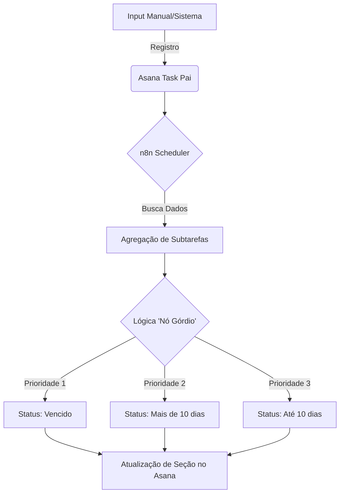

# 🏛️ Projeto Lumen: Automação LAI

Este repositório centraliza as soluções de automação desenvolvidas para otimizar o Acompanhamento, Controle e Monitoramento dos Pedidos de Acesso à Informação (Lei nº 12.527/2011).

O projeto atua como uma **camada de inteligência** entre o sistema oficial (SIC) e a gestão operacional, utilizando metodologias ágeis e orquestração de microsserviços para garantir a transparência passiva e o cumprimento rigoroso dos prazos legais.

## 🛠️ Infraestrutura e Stack Tecnológica

O ambiente foi desenhado seguindo princípios de **Soberania de Dados** e baixo custo, operando em infraestrutura própria (On-Premise/Home Lab) isolada da rede corporativa.

- **Orquestrador:** [n8n](https://n8n.io/) (Self-hosted via Docker).
- **Hardware:** Raspberry Pi 3.
- **Rede & Segurança:** Cloudflare Tunnel (Zero Trust) para exposição segura sem abertura de portas, conectado a um domínio personalizado (**Registro.br**).
- **Gestão de Projetos:** Asana (Integração via API).
- **Frontend/Interface:** Scripts [Tampermonkey](https://www.tampermonkey.net/) para injeção de métricas no navegador client-side.

## 💡 Desafios Técnicos Superados

### 1. Atualização "Nó Górdio" (Resolução de Race Condition)
O principal desafio lógico do projeto foi apelidado de *"Nó Górdio"*. Tratava-se de uma condição de corrida onde o cálculo cronológico da data de abertura do chamado conflitava com a data fatal de vencimento, gerando inconsistência no status.
- **O Problema:** O n8n processava subtarefas de "Abertura" e "Encerramento" de forma independente. Se a regra de idade rodasse por último, ela sobrescrevia o status de "Vencido".
- **A Solução:** Implementação de um algoritmo de agregação em JavaScript. O fluxo agora consolida todas as subtarefas de um mesmo chamado antes de tomar a decisão, priorizando hierarquicamente o status "Vencido".
- **Resultado:** Eliminação de 100% dos falsos positivos e redução de **50% nas chamadas de API** (overhead), vital para a performance do Raspberry Pi 3.

### 2. Parser de Datas Customizadas
Desenvolvimento de um interpretador para strings no formato brasileiro (`DD/MM/YYYY às HH:mm`) inseridas nas notas das tarefas, permitindo precisão decimal no cálculo de janelas de 24 horas (SLA).

## 📊 Lógica do Fluxo (Diagrama)


## 🛡️ Compliance e Privacidade (LGPD)
Alinhado às melhores práticas de governança e certificações **EXIN (ISFS, PDPF, PDPELGPD)**, o projeto adota o princípio de Privacy by Design para garantir que projetos pessoais não comprometam dados institucionais:

1. **Isolamento:** A infraestrutura roda em ambiente controlado, sem conexão direta com servidores governamentais.

2. **Minimização:** O fluxo processa apenas metadados de controle (IDs e Datas), sem trafegar ou armazenar o conteúdo sensível dos pedidos de informação dos cidadãos.

3. **Segurança:** Utilização de túneis criptografados (Cloudflare) para evitar exposição de IP residencial.

## 📂 Estrutura do Repositório

- 📂 Fluxos/: Contém os workflows para importação no n8n.
    - ``Acompanhamentos_LAI.json``: Fluxo principal contendo a lógica da atualização "Nó Górdio".

- 📂 Scripts/: Scripts auxiliares client-side.

    - ``Painel_LAIs_em_Andamento.js``: Script Tampermonkey para dashboard visual.

## 🚀 Como Rodar (Instalação)

**1. Pré-requisitos**
- Raspberry Pi com Docker e Docker Compose.
- Token de Acesso Pessoal (PAT) do Asana.

**2. Subindo o n8n**

Exemplo de configuração do ``docker-compose.yml``:

```yaml
version: '3.1'
services:
  n8n:
    image: n8nio/n8n:latest
    restart: always
    ports:
      - "5678:5678"
    environment:
      - TZ=America/Sao_Paulo
    volumes:
      - ./n8n_data:/home/node/.n8n
```
---

*Projeto desenvolvido para fins de estudo em automação e eficiência de processos.*